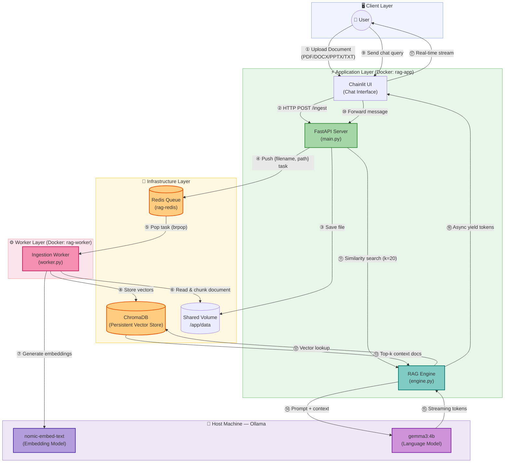

# System Architecture — Real-Time Streaming RAG Application

## Architecture Diagram

---

## Component Descriptions

### 1. 🖥️ Chainlit UI (`backend/app/main.py`)
The user-facing chat interface, mounted directly on the FastAPI server at the root path (`/`). It handles:
- **File uploads**: Reads binary content and relays to the ingestion pipeline
- **Chat messages**: Streams LLM tokens directly into the chat using `msg.stream_token()`
- **Error display**: Shows ingestion and generation errors inline

### 2. ⚡ FastAPI Server (`backend/app/main.py`)
The central API gateway responsible for:
- **`GET /health`**: Liveness probe for Docker and load balancers
- **`POST /ingest`**: Validates file type, saves to shared volume, pushes a JSON task onto the Redis queue
- **Non-blocking design**: Never waits for document processing — returns immediately after queuing

### 3. 🧠 RAG Engine (`backend/app/engine.py`)
Core retrieval-and-generation logic:
- Performs `similarity_search(k=20)` against ChromaDB
- Groups results by source document, prioritizing the most recently uploaded
- Builds a prompt: `Context: {chunks}\n\nQuestion: {query}\n\nAnswer:`
- Streams Gemma 3:4b's response via `llm.astream()` — yielding each token as it arrives

### 4. ⚙️ Ingestion Worker (`backend/app/worker.py`)
A long-running async process that:
- Listens on the Redis `ingestion_queue` with `brpop` (blocking pop, non-CPU-blocking)
- Loads documents using LangChain loaders (PyPDF, Unstructured for PPTX/DOCX, TextLoader)
- Splits into 1000-token chunks with 100-token overlap using `RecursiveCharacterTextSplitter`
- Embeds chunks via `nomic-embed-text` and stores in ChromaDB
- Attaches `source` filename to every chunk's metadata for citation

### 5. 🔄 Redis Queue (`redis:alpine`)
Acts as the **decoupling layer** between the API and the worker:
- Ensures the FastAPI server stays responsive even during heavy ingestion (50-page PDFs)
- Uses a simple list-based queue (`lpush` / `brpop`)
- Healthchecked via `redis-cli ping` before dependent services start

### 6. 🗄️ ChromaDB (Persistent Vector Store)
- Embedded vector database, persisted to `./chroma_db/` on the host via Docker volume mount
- Survives container restarts — no re-indexing required
- Queried in O(log n) time using HNSW approximate nearest-neighbor search

### 7. 🦙 Ollama (Host Machine)
Runs on the host machine and is accessed by containers via `host.docker.internal:11434`:
- **`nomic-embed-text`**: Generates 768-dimensional embeddings for chunks and queries
- **`gemma3:4b`**: 4-billion parameter model for response generation; requires ~4 GB VRAM/RAM

---

## Key Design Decisions

### Decoupling via Redis
Using Redis as a message broker means the API never blocks on document processing. A user can upload a 50-page PDF and continue chatting immediately while the worker handles chunking and embedding in the background.

### Shared Volume Bridge
The Docker volume (`/app/data`) is mounted to **both** the `app` and `worker` containers. This avoids duplicating file data — the API writes once, the worker reads from the same path.

### Async-First Architecture
Every I/O operation uses `async/await`:
- `asyncio.to_thread()` wraps ChromaDB's synchronous similarity search
- `langchain.astream()` yields tokens without blocking the event loop
- `redis.asyncio` for non-blocking queue operations

### Local-First Privacy
All inference runs on the host machine via Ollama. No data leaves your network — no API keys, no cloud costs, no rate limits.